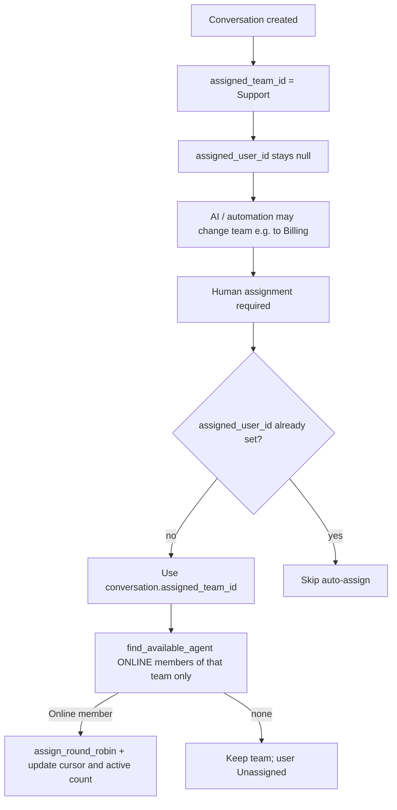

# Auto-Assignment via Agent Status — Implementation Plan

**Goal:** Make the existing Online / Away / Offline agent status useful for automatic conversation and ticket assignment, using the conversation’s **current assigned team** and existing round-robin logic — without building a new routing engine.

**Principle:** Team routing and user assignment stay separate. Default Support team on create is unchanged. User auto-assignment runs only when a human is actually needed, and only among **ONLINE** members of the conversation’s **current** team.

**Rule:** Extend Day 6 `AssignmentService` (`find_available_agent` / `assign_round_robin`). Do not fork assignment into AI, escalation, or inbox code. Do not auto-assign a user at conversation create.

**Depends on:** `AgentAvailability` (ONLINE / AWAY / OFFLINE), `Team` / `TeamMember`, `teams.last_assigned_user_id`, conversation/ticket `assigned_team_id` / `assigned_user_id`, existing escalation team resolve (intent → team map), inbox status dropdown.

**Status:** IMPLEMENTED. See `AssignmentService.ensure_assignee_for_team` / `auto_assign_if_needed`, escalation / ticket PATCH / conversation team transfer / AI-off / takeover wiring, and `backend/tests/test_auto_assignment.py`.

---

## 1. Executive summary

| Capability | Today | After this work |
|------------|--------|-----------------|
| New conversation team | Default **Support** via `_assign_default_team` | Unchanged |
| New conversation user | Always Unassigned (`assigned_user_id` null) | Unchanged — **never** auto-assign on create |
| Agent status dropdown | Online / Away / Offline in inbox | Same UI; Online = eligible for auto-assign |
| Round-robin | Exists in `AssignmentService`; only via optional automation | Also called on human-need paths |
| Which team’s members | N/A / automation config | **Conversation’s current `assigned_team_id` only** |
| AI routes Support → Billing | Team updated; user still Unassigned | Later auto-assign picks a **Billing** Online member, not Support |
| No Online teammates | Stays Unassigned | Same: keep team, leave user Unassigned |
| Manual assign | PATCH conversation / ticket | Unchanged; never overwritten by auto-assign |

---

## 2. What already exists (reuse — do not rebuild)

| Piece | Path | Role |
|-------|------|------|
| Status enum + storage | `backend/app/modules/ai/domain/models.py` | `AgentStatus` ONLINE / AWAY / OFFLINE on `agent_availability` |
| Status API + UI | `backend/app/modules/agents/router.py`, `frontend/src/features/agents/AgentAvailabilityControl.tsx` | Inbox dropdown |
| Round-robin | `backend/app/modules/assignment/application/service.py` | `find_available_agent` / `assign_round_robin` — ONLINE only by default; least `active_conversation_count`; cursor `teams.last_assigned_user_id` |
| Default team | `ConversationService._assign_default_team` | New chats → Support team; **user still null** |
| Escalation tickets | `EscalationService._create_ticket` | Sets `assigned_team_id` (intent map / Support); **not** `assigned_user_id` |
| Team change on escalate | Same | May overwrite conversation team (e.g. Support → Billing) before a human is assigned |
| Automation action | `ASSIGN_ROUND_ROBIN` | Optional rules; complementary, not replaced |

**Gap:** Status is already enforced inside `assign_round_robin`, but nothing calls it when work needs a human — so Inbox stays Unassigned even with Online agents on the right team.

---

## 3. Requirements (exact)

1. Every new conversation defaults to the **Support** team as it does currently.
2. Do **not** automatically assign a user when the conversation is created.
3. When a human assignment is actually required, first use the conversation’s **current** `assigned_team_id`.
4. Assign the conversation to an **ONLINE** member of that **exact** team only.
5. If AI/routing changes the conversation from Support to Billing, the eventual assignee must be a **Billing** team member, **not** a Support member. Same for any other team.
6. Use existing round-robin / rotation so load is distributed fairly among ONLINE members of the selected team.
7. AWAY / OFFLINE members must **not** receive automatic assignments.
8. If the selected team has no eligible ONLINE members, keep the team assigned and leave the user Unassigned.
9. Never overwrite an existing manual / user assignment (`assigned_user_id` already set → no-op).
10. Existing Support default-team, AI, escalation, ticket, inbox, manual assignment, automation, and routing behavior must not break.

---

## 4. Design decision

**Trigger on human need, not on every create.**

| Trigger | Behavior |
|---------|----------|
| Conversation create / email inbound | Default Support team only; **no** user assign |
| AI soft-reply / resolve (no escalate) | No auto-assign |
| AI escalation / missed-chat / timeout ticket | After team is resolved on the conversation, auto-assign from **that** team |
| AI disabled + Online agents on current team | Auto-assign from current team (instead of leaving Unassigned forever) |
| AI disabled + no Online agents | Existing missed-chat / WAITING path; user stays Unassigned |
| Agent takeover | If still unassigned, assign **to the taking agent** (intentional self-assign, not RR); do not clear an existing assignee |

**Eligibility for automatic RR:** `allow_away=False`, `allow_offline=False` → ONLINE only.

**Team source of truth at assign time:** `conversation.assigned_team_id` after any prior routing (default Support, intent map, automation `ASSIGN_TEAM`, etc.). Do not hardcode Support for user pick.

---

## 5. Minimal changes

### 5.1 DB

**None required.** Reuse:

- `agent_availability.status`, `active_conversation_count`
- `teams.last_assigned_user_id` (per-team RR cursor)
- `conversations.assigned_team_id` / `assigned_user_id`
- `tickets.assigned_team_id` / `assigned_user_id`

No org settings toggle in v1.

### 5.2 Backend

1. **Thin helper** on `AssignmentService`, e.g. `auto_assign_if_needed(conversation_id, organization_id, team_id: str | None = None) -> str | None`:
   - No-op if `conversation.assigned_user_id` is already set.
   - Resolve team: explicit `team_id` if passed, else **`conversation.assigned_team_id`** (must be the post-routing team).
   - If still no team, leave Unassigned (do not invent a different team for user pick; create path already set Support).
   - Call existing `assign_round_robin(..., allow_away=False, allow_offline=False)`.
   - Return assignee id or `None`.

2. **Ticket mirror** (escalation path only): after successful conversation RR, set `ticket.assigned_user_id` and `ticket.assigned_team_id` to match the conversation. Same agent; no second routing algorithm. Skip if conversation already had a user.

3. **Wire call sites only:**
   - `EscalationService._create_ticket` — after team resolve and conversation team sync (Support → Billing etc.), call `auto_assign_if_needed` using the conversation’s **current** team, then mirror onto the ticket.
   - `MissedChatService.route_incoming_if_ai_disabled` — when Online agents exist, auto-assign from current team; when none, keep existing WAITING / offline notice behavior.
   - `ConversationService.takeover` — if `assigned_user_id` is null, assign to the taking user via `assign_user` with a path that allows Away (manual-equivalent); never overwrite an existing assignee.

4. **Do not change:**
   - `_assign_default_team` / create / email inbound user fields
   - Manual `update_conversation` / ticket PATCH
   - AI graph, response policy, automation engine internals
   - Inbox list filter semantics (Mine / Unassigned / Team)

### 5.3 Frontend

**Minimal:** clarify copy on `AgentAvailabilityControl` (e.g. Online = eligible for automatic assignment on your teams). No new routing UI or settings page for v1.

### 5.4 Docs (after implement)

- This plan: `docs/auto-assignment-plan.md`
- Light updates: `docs/manual-test-scenarios.md`, `docs/codebase-map.md`

---

## 6. Assignment logic (v1)

1. Read `conversation.assigned_team_id` (the current team after any routing).
2. Eligible = members of **that team** with `AgentAvailability.status == ONLINE`.
3. Prefer agent ≠ `team.last_assigned_user_id`, then lowest `active_conversation_count` (existing `find_available_agent`).
4. On assign: set conversation user (+ ensure team), bump `active_conversation_count`, update that team’s `last_assigned_user_id`, publish `conversation.assigned` as today.
5. If none eligible: team unchanged, `assigned_user_id` stays null → Unassigned filter still works.

**Example:** Create → Support, Unassigned → intent routes conversation to Billing → escalate → RR among Billing ONLINE members only.

---

## 7. Fallback and compatibility

| Case | Behavior |
|------|----------|
| Online member on current team | Auto-assign that member |
| Current team is Billing; only Support has Online agents | Leave Unassigned (do **not** fall back to Support members) |
| Only Away / Offline / no members / no availability row | Keep team; user Unassigned |
| Already assigned | No overwrite |
| Manual reassign | Unchanged PATCH |
| Custom `ASSIGN_ROUND_ROBIN` automation | Still works; auto path is complementary |
| AI soft-reply / resolve without escalate | No auto-assign |
| Default Support on create | Unchanged |

---

## 8. Tests (targeted)

Extend / add beside existing Day 6 tests:

- Create conversation alone → Support team, `assigned_user_id` is null.
- Escalation with conversation on Support + Online Support member → assigns that member; ticket mirrors.
- Conversation team changed to Billing before/at escalate + Online Billing member + Online Support member → assignee is Billing member, not Support.
- Away / Offline only on selected team → team set, user Unassigned.
- Second assign on same team prefers different Online agent (cursor / load).
- AI-disabled + Online on current team → assigned; all Offline → existing WAITING / Unassigned behavior.
- Takeover sets assignee to current user when previously null; does not overwrite existing assignee.
- Manual assign still works.
- Regression: `test_day6_assignment_round_robin.py`, `test_day6_availability.py`, intent-team routing tests.

---

## 9. Out of scope

- Skill-based / geo / SLA-priority routing
- Presence heartbeat (keep manual status)
- Auto-assign on every `conversation.created`
- Falling back to another team’s Online members when the current team has none
- Seeding a global automation rule as the only mechanism
- Changing inbox filter semantics
- Org settings UI for auto-assign toggle

---

## 10. Implementation order (when coding)

1. `AssignmentService.auto_assign_if_needed` (+ ticket mirror helper) — always keyed off current team
2. Wire `EscalationService._create_ticket` (after team sync)
3. Wire AI-off Online path in `MissedChatService`
4. Wire takeover self-assign
5. Frontend helper text
6. Targeted tests + short manual scenarios

---

## 11. Acceptance checklist

- [x] New conversations still default to Support with no user assignee
- [x] Auto-assign uses conversation’s current team only
- [x] Support → Billing routing yields Billing Online assignee
- [x] AWAY / OFFLINE never auto-assigned
- [x] No Online on that team → Unassigned user, team preserved
- [x] Existing assignee never overwritten by auto path
- [x] Manual assign, AI, escalation, tickets, inbox, automations unchanged in behavior aside from the wired human-need paths

### Team rotation (v1)

Per-team cyclic rotation among **ONLINE** members only via `teams.last_assigned_user_id`:

`A → B → C → A → B → C` (stable `user_id` order among eligible members of that team).

No cross-team fallback. Billing conversations never assign Support members.

### Ticket transfer lifecycle

| Event | Behavior |
|-------|----------|
| Ticket created for a team (no explicit user) | `ensure_assignee_for_team` → ONLINE RR on that team; conversation + ticket stay in sync |
| Team transfer (Support → Billing, or any team) | Set new team; clear prior assignee if they are not a member of the new team; RR among ONLINE members of the **new** team only |
| New team has no ONLINE members | Keep new team; `assigned_user_id` null |
| Manual user/team set together | `sync_manual_assignment` — no RR overwrite |
| Assignee already on the new team | Keep that assignee (no forced RR) |

**Team-change call sites:** escalation create, `POST/PATCH /tickets`, conversation team PATCH, automation `ASSIGN_TEAM` / `ASSIGN_TICKET` / `CREATE_TICKET`.
