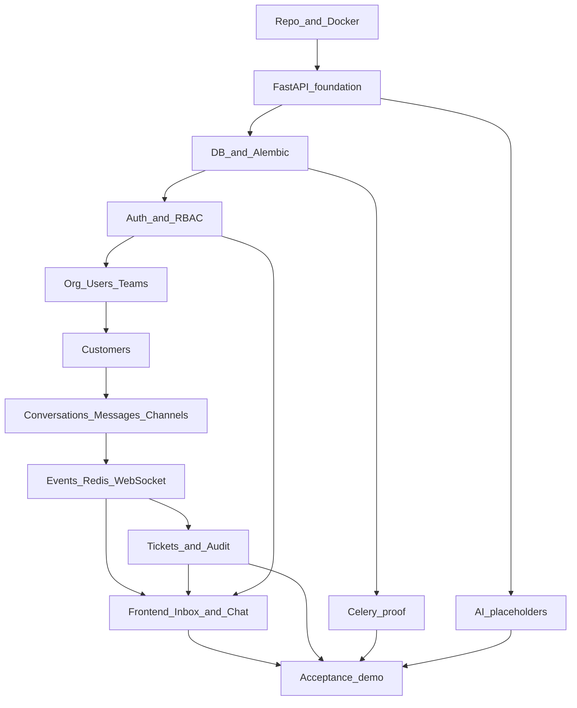

# Day 1 Implementation Plan — AI Customer Support Platform

**Goal:** Ship a single-tenant **Support Platform Core** (auth, org/users/RBAC, customers, conversations/messages, tickets, inbox, realtime). AI is prepared as interfaces only — not wired into chat.

**Rule:** Support Core first. AI Runtime second.

---

## Acceptance demo (must work end-to-end)

1. `docker compose up`
2. Open React app → login as Agent
3. Open Inbox → create Customer
4. Open Web Chat → customer sends `"Hello, I need help."`
5. Agent sees conversation/message in realtime
6. Agent replies `"How can I help?"` → customer receives it
7. Agent assigns, changes priority, closes conversation
8. Audit records exist for those mutations

No manual DB edits.

---

## Recommended order (critical path)

Build in this sequence so each layer unblocks the next. Items marked *parallel* can run beside the critical path once their deps exist.

```
1. Repo + Docker Compose
2. FastAPI foundation (health, config, CORS, logging)
3. Database + Alembic (all entities, seed org/roles/agent)
4. Auth + RBAC deps
5. Org / Users / Teams (minimal APIs)
6. Customers CRUD
7. Conversations + Messages + ChannelAdapter
8. Event bus → Redis pub/sub → WebSocket
9. Tickets + AuditLog
10. Celery hello-world worker          (*parallel after Redis*)
11. AI placeholders + minimal LangGraph (*parallel after backend skeleton*)
12. Observability (request/correlation IDs, OTel hooks)
13. Frontend: auth → customers → inbox + web chat + WS
14. Tests + README → run acceptance checklist
```



---

## Phase A — Project setup

**Depends on:** nothing  
**Unlocks:** everything

- [x] Create monorepo layout:

```
support-platform/
├── backend/          # FastAPI app, migrations, tests, Dockerfile, .env.example
├── frontend/         # Vite React TS, Dockerfile, .env.example
├── docker-compose.yml
├── .gitignore
├── README.md
└── Makefile
```

- [x] Backend module skeleton under `backend/app/` (`api/`, `modules/*`, `infrastructure/*`, `workers/`, `config/`)
- [x] Placeholder dirs for later: `ai/`, `knowledge/`, `automation/`, `integrations/` (interfaces only)
- [x] Frontend feature-based `src/` (`app/`, `features/`, `components/`, `services/api/`, `hooks/`, `types/`, `utils/`)

**Stack lock:** Python 3.12+, FastAPI, Pydantic v2, SQLAlchemy 2.x, Alembic, PostgreSQL, Redis, Celery, WebSockets, pytest · React, TypeScript, Vite, React Router, TanStack Query, React Hook Form, Zod · Docker Compose · LangChain/LangGraph deps installed but unused in chat flow.

---

## Phase B — Docker environment

**Depends on:** A  
**Unlocks:** local DB/Redis, running API/UI/worker

- [x] Compose services: `frontend`, `backend`, `postgres` (pgvector image/extension), `redis`, `worker`
- [x] Shared env via `.env.example` (no secrets committed)
- [x] Makefile targets: `up`, `down`, `migrate`, `test`, `logs`
- [x] Verify: `docker compose up` starts the full stack

**Note:** Enable pgvector in Postgres now; do not add a separate vector DB.

---

## Phase C — FastAPI foundation

**Depends on:** B (or local Python + DB)  
**Unlocks:** all API modules

- [x] `GET /health` and `GET /api/v1/health` → `{"status":"ok"}`
- [x] Settings/config from env
- [x] CORS for frontend origin
- [x] Structured logging
- [x] Global exception handling
- [x] API versioning under `/api/v1`
- [x] OpenAPI auto-docs
- [x] DB session dependency
- [x] Stub auth dependency (filled in Phase E)

---

## Phase D — Database foundation

**Depends on:** C  
**Unlocks:** Auth, domain APIs, migrations

### Entities (Day 1)

| Entity | Notes |
|--------|--------|
| Organization | Single org; entities keep `organization_id` — no tenant router/pool |
| User, Role | Roles: OWNER, ADMIN, MANAGER, AGENT, READ_ONLY |
| Team, TeamMember | For assign/inbox filters |
| Customer | Basic profile only (not Customer 360) |
| Conversation, Message, Participant | Core messaging |
| Ticket | Separate from conversation |
| AuditLog | Mutation trail |

### Relationships

```
Organization
├── Users, Teams, Customers
└── Conversations → Messages
```

### Tasks

- [x] SQLAlchemy 2.x models + enums (channel, status, priority, sender_type, ticket status, actor_type)
- [x] Alembic initial migration
- [x] Seed: one Organization, roles, at least one Agent user with known password
- [x] Do **not** build TenantResolver / TenantDatabase / TenantConnectionPool

### Key fields (implement exactly)

- **Organization:** id, name, domain, timezone, logo_url, settings, created_at, updated_at
- **Customer:** id, organization_id, name, email, phone, company_name, external_id, metadata, created_at, updated_at
- **Conversation:** id, organization_id, customer_id, channel, status, priority, assigned_user_id, assigned_team_id, created_at, updated_at  
  - Channels: `WEB_CHAT`, `EMAIL`, `FORM`  
  - Statuses: `OPEN`, `PENDING`, `CLOSED`  
  - Priorities: `LOW`, `NORMAL`, `HIGH`, `URGENT`
- **Message:** id, conversation_id, sender_type, sender_id, content, metadata, created_at, updated_at  
  - Sender types: `CUSTOMER`, `AGENT`, `AI`, `SYSTEM` (include AI now)
- **Ticket:** id, conversation_id, status, priority, assigned_user_id, assigned_team_id, created_at, resolved_at, closed_at  
  - Statuses: `OPEN`, `IN_PROGRESS`, `WAITING`, `RESOLVED`, `CLOSED`
- **AuditLog:** id, organization_id, actor_type, actor_id, action, entity_type, entity_id, old_value, new_value, created_at

---

## Phase E — Authentication

**Depends on:** D  
**Unlocks:** protected APIs, frontend login

- [x] `POST /api/v1/auth/login` — password auth
- [x] `POST /api/v1/auth/logout`
- [x] `GET /api/v1/auth/me`
- [x] Secure password hashing
- [x] Access token or session
- [x] `current_user` dependency
- [x] Out of scope: SSO, OAuth, MFA

---

## Phase F — RBAC

**Depends on:** E  
**Unlocks:** permission-gated domain routes

**Roles:** OWNER, ADMIN, MANAGER, AGENT, READ_ONLY

**Permissions:**

| Area | Permissions |
|------|-------------|
| Customers | `customers.read`, `customers.write` |
| Conversations | `conversations.read`, `conversations.write`, `conversations.assign` |
| Tickets | `tickets.read`, `tickets.write` |
| Users | `users.read`, `users.write` |
| Teams | `teams.read`, `teams.write` |
| Settings | `settings.read`, `settings.write` |

- [x] Role → permission map
- [x] Reusable `require_permission(...)` dependency (auth → authz → endpoint)
- [x] No scattered role checks inside business services

---

## Phase G — Organization / Users / Teams

**Depends on:** F  
**Unlocks:** assign, inbox Team filter

- [x] Organization model used by all entities (single seeded org)
- [x] Users readable for assignment UI (as needed)
- [x] `GET /api/v1/teams`, `POST /api/v1/teams`
- [x] Team membership for “Mine / Team” inbox views

---

## Phase H — Customers

**Depends on:** F  
**Unlocks:** conversations, demo step “create customer”

- [x] `GET /api/v1/customers`
- [x] `GET /api/v1/customers/{id}`
- [x] `POST /api/v1/customers`
- [x] `PATCH /api/v1/customers/{id}`
- [x] Emit `customer.created` / `customer.updated` events; audit on update

---

## Phase I — Conversations, Messages, Channels

**Depends on:** H  
**Unlocks:** Web Chat, inbox, tickets, realtime

This is the **most important** Day 1 domain.

### Conversation / Message APIs

- [x] `GET/POST /api/v1/conversations`
- [x] `GET/PATCH /api/v1/conversations/{id}` (status, priority, assign, close/reopen)
- [x] `GET/POST /api/v1/conversations/{id}/messages`

### Channel abstraction (do not couple Web Chat to domain)

```
ChannelAdapter: receive / send / normalize / identify_customer
  ├── WebChatAdapter   (implement)
  ├── EmailAdapter     (stub)
  └── FormAdapter      (stub)

IncomingMessage → ConversationService → Message
```

- [x] Implement `WebChatAdapter`; stub Email/Form for future plug-in
- [x] Participant model for conversation membership

### Web Chat (minimum)

Customer React chat → create conversation → post message → store → WS event → agent inbox.  
No AI reply, personality, typing indicator, or widget customization.

---

## Phase J — Event system + Redis + WebSocket

**Depends on:** I + Redis (Phase B)  
**Unlocks:** realtime inbox

### Domain events (emit from services)

`customer.created|updated` · `conversation.created|updated|assigned|closed` · `message.created` · `ticket.created|assigned|resolved`  
(Reserve names for later: `ai.run.started`, `ai.intent.detected`, `ai.response.generated`, `ai.escalated`, `ai.resolved` — do not implement.)

### Realtime flow

```
Mutation → PostgreSQL → Event → Redis pub/sub → WebSocket → Agent UI
```

### WebSocket events (Day 1)

- [x] `message.created`
- [x] `conversation.updated`
- [x] `conversation.assigned`
- [x] `conversation.closed`

---

## Phase K — Tickets + Audit

**Depends on:** I (+ J for event hooks)  
**Unlocks:** escalation abstraction, compliance trail

### Tickets

Conversation is not automatically a ticket. Ticket = escalation / human intervention.

- [x] `GET/POST /api/v1/tickets`
- [x] `GET/PATCH /api/v1/tickets/{id}`

### Audit

Track at least: `conversation.assigned`, `conversation.closed`, `ticket.created`, `ticket.assigned`, `customer.updated`, `user.role_changed`.

- [x] Persist AuditLog on those mutations

---

## Phase L — Celery + Redis workers

**Depends on:** B (Redis) + C  
**Unlocks:** proof of async jobs (email/knowledge/AI later)

- [x] Celery app wired to Redis
- [x] Worker Compose service
- [x] One successful hello-world / health task (enough for Day 1)
- [x] Do not build email processing, embeddings, or AI jobs yet

---

## Phase M — AI foundation (prepare only)

**Depends on:** C (+ D for pgvector readiness)  
**Not on critical path for demo** — do after or beside core APIs

- [x] Interfaces: `LLMProvider`, `EmbeddingProvider`, `Retriever`, `AIService`, `AgentRuntime`
- [x] Module layout:

```
app/modules/ai/
├── domain/          # interfaces.py, schemas.py
├── application/     # ai_service.py
├── infrastructure/  # langchain/, langgraph/, llm/, retrieval/
└── graphs/
```

- [x] Install LangChain / LangGraph; provider abstraction stubs (OpenAI/Anthropic/Gemini hooks)
- [x] Minimal graph only: `START → Input → Model → Output → END` (validates infra)
- [x] **Do not** attach AI to conversation/message flow
- [x] pgvector enabled; optional empty tables/placeholders for KnowledgeSource / Document / DocumentChunk / Embedding — **no** ingestion pipeline

---

## Phase N — Observability foundation

**Depends on:** C  
**Unlocks:** traceable requests for later AI multi-call runs

- [x] Structured app logs
- [x] Request ID + correlation ID middleware
- [x] Error handling consistent with Phase C
- [x] OpenTelemetry hooks (foundation only)
- [x] Design logs to carry `request_id`, and later `conversation_id` / `message_id` / `ai_run_id`

---

## Phase O — Frontend

**Depends on:** E + H + I + J (APIs + WS)  
**Unlocks:** acceptance demo UI

### Stack usage

TanStack Query (server state) · React Hook Form + Zod (forms) · React Router

### Features to ship

- [x] Auth (login, session, `/me`, logout)
- [x] Customers (create + list enough for demo)
- [x] Inbox (3-pane): filters All / Mine / Unassigned / Team · conversation list · thread + reply
- [x] Inbox actions: open, reply, assign, change priority/status, close, reopen
- [x] Web Chat skeleton (customer-facing)
- [x] WebSocket client subscribed to conversation/message events
- [x] Tickets feature stub or minimal list/create if time; not required for core demo path beyond API

### Suggested route order

1. Login page  
2. Inbox shell (can load empty)  
3. Customers  
4. Wire conversations/messages + WS  
5. Web Chat page  

---

## Phase P — Testing + README

**Depends on:** domain APIs (+ ideally O)  
**Unlocks:** Day 1 sign-off

- [x] pytest: health, auth, customer CRUD, conversation + message flow, permission denial smoke
- [x] Prefer API-level tests over UI e2e for Day 1
- [x] README: clone, env, `docker compose up`, migrate/seed, default agent credentials, how to run demo
- [x] Walk the acceptance demo checklist once on a clean Compose stack

---

## Day 1 API surface (track completeness)

| Area | Endpoints |
|------|-----------|
| Auth | `POST /auth/login`, `POST /auth/logout`, `GET /auth/me` |
| Customers | `GET/POST /customers`, `GET/PATCH /customers/{id}` |
| Conversations | `GET/POST /conversations`, `GET/PATCH /conversations/{id}` |
| Messages | `GET/POST /conversations/{id}/messages` |
| Tickets | `GET/POST /tickets`, `GET/PATCH /tickets/{id}` |
| Teams | `GET/POST /teams` |
| System | `GET /health`, `GET /api/v1/health` |

(All under `/api/v1` except root `/health` if kept dual.)

---

## Out of scope (do not build on Day 1)

- Production AI agent, RAG pipeline, prompt engineering, confidence/sentiment, AI escalation/summaries/autonomous actions  
- Stripe, HubSpot, Jira, Slack, WhatsApp, MCP  
- Complex workflow builder, advanced analytics  
- SSO / OAuth / MFA  
- Multi-tenant routing infrastructure  

---

## Master progress checklist (deliverables)

- [x] FastAPI application
- [x] React + TypeScript application
- [x] PostgreSQL with pgvector enabled
- [x] Redis
- [x] Celery (worker + one successful job)
- [x] Docker Compose
- [x] Alembic migrations
- [x] Authentication
- [x] RBAC foundation
- [x] Organization (single-tenant)
- [x] Users
- [x] Teams
- [x] Customers
- [x] Conversations
- [x] Messages (incl. AI sender type)
- [x] Tickets
- [x] Web Chat skeleton
- [x] WebSocket communication
- [x] Shared Inbox skeleton
- [x] Audit logs
- [x] Event foundation
- [x] LangChain foundation
- [x] LangGraph foundation (minimal graph)
- [x] LLM abstraction
- [x] Basic tests
- [x] README with setup instructions
- [ ] Acceptance demo passed (requires local Docker Compose — daemon not available in build environment)

---

## Efficiency tips

1. Seed data early (org + agent) so auth/UI work without manual SQL.  
2. Finish conversation/message + events + WS before polishing tickets or AI stubs.  
3. Stub Email/Form adapters; only implement WebChat.  
4. Frontend can start against OpenAPI once auth + customers land; swap in WS as soon as Phase J is ready.  
5. Keep AI modules compile/import-safe but disconnected from `ConversationService`.  
6. Prefer thin routers → application services → repositories; emit events from services, not controllers.
